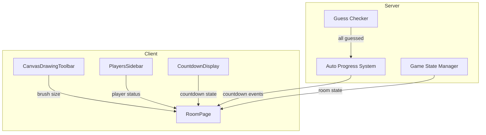

# Design Document: Game UX Improvements

## Overview

This design document outlines the implementation of four key UX improvements for the Draw and Guess game:
1. Professional SVG icons for drawing tools
2. Professional SVG icons for player list
3. Slider-based brush size selector
4. Automatic turn/round progression with countdown timers

The changes span both client-side React components and server-side Socket.IO event handling.

## Architecture



## Components and Interfaces

### 1. SVG Icon Components

Create a new `Icons.jsx` file containing reusable SVG icon components:

```jsx
// client/src/ui/Icons.jsx

export const BrushIcon = ({ size = 24, color = 'currentColor' }) => (
  <svg width={size} height={size} viewBox="0 0 24 24" fill="none" stroke={color} strokeWidth="2">
    <path d="M12 19l7-7 3 3-7 7-3-3z"/>
    <path d="M18 13l-1.5-7.5L2 2l3.5 14.5L13 18l5-5z"/>
    <path d="M2 2l7.586 7.586"/>
    <circle cx="11" cy="11" r="2"/>
  </svg>
);

export const EraserIcon = ({ size = 24, color = 'currentColor' }) => (
  <svg width={size} height={size} viewBox="0 0 24 24" fill="none" stroke={color} strokeWidth="2">
    <path d="M20 20H7L3 16c-.8-.8-.8-2 0-2.8L13.4 2.8c.8-.8 2-.8 2.8 0L21 7.6c.8.8.8 2 0 2.8L12 19"/>
  </svg>
);

export const TrashIcon = ({ size = 24, color = 'currentColor' }) => (
  <svg width={size} height={size} viewBox="0 0 24 24" fill="none" stroke={color} strokeWidth="2">
    <path d="M3 6h18"/>
    <path d="M19 6v14a2 2 0 01-2 2H7a2 2 0 01-2-2V6"/>
    <path d="M8 6V4a2 2 0 012-2h4a2 2 0 012 2v2"/>
  </svg>
);

export const UndoIcon = ({ size = 24, color = 'currentColor' }) => (
  <svg width={size} height={size} viewBox="0 0 24 24" fill="none" stroke={color} strokeWidth="2">
    <path d="M3 7v6h6"/>
    <path d="M21 17a9 9 0 00-9-9 9 9 0 00-6 2.3L3 13"/>
  </svg>
);

export const CrownIcon = ({ size = 16, color = '#FFD700' }) => (
  <svg width={size} height={size} viewBox="0 0 24 24" fill={color}>
    <path d="M12 2L15.09 8.26L22 9.27L17 14.14L18.18 21.02L12 17.77L5.82 21.02L7 14.14L2 9.27L8.91 8.26L12 2Z"/>
  </svg>
);

export const PencilIcon = ({ size = 16, color = '#FF8C42' }) => (
  <svg width={size} height={size} viewBox="0 0 24 24" fill="none" stroke={color} strokeWidth="2">
    <path d="M17 3a2.828 2.828 0 114 4L7.5 20.5 2 22l1.5-5.5L17 3z"/>
  </svg>
);

export const CheckIcon = ({ size = 16, color = '#4ade80' }) => (
  <svg width={size} height={size} viewBox="0 0 24 24" fill="none" stroke={color} strokeWidth="3">
    <path d="M20 6L9 17l-5-5"/>
  </svg>
);

export const UserIcon = ({ size = 24, color = 'currentColor' }) => (
  <svg width={size} height={size} viewBox="0 0 24 24" fill="none" stroke={color} strokeWidth="2">
    <circle cx="12" cy="8" r="4"/>
    <path d="M20 21a8 8 0 10-16 0"/>
  </svg>
);

export const MicrophoneIcon = ({ size = 16, color = '#4ade80' }) => (
  <svg width={size} height={size} viewBox="0 0 24 24" fill="none" stroke={color} strokeWidth="2">
    <rect x="9" y="2" width="6" height="11" rx="3"/>
    <path d="M19 10v2a7 7 0 01-14 0v-2"/>
    <line x1="12" y1="19" x2="12" y2="22"/>
  </svg>
);
```

### 2. Updated CanvasDrawingToolbar

The toolbar will use SVG icons and maintain the existing slider for brush size:

```jsx
// Key changes to CanvasDrawingToolbar.jsx
import { BrushIcon, EraserIcon, TrashIcon, UndoIcon } from './Icons';

// Replace emoji buttons with SVG icon buttons
<button className={`tool-btn ${selectedTool === 'brush' ? 'active' : ''}`}>
  <BrushIcon size={20} />
</button>
```

### 3. Updated PlayersSidebar

Replace emoji badges with SVG icons:

```jsx
// Key changes to PlayersSidebar.jsx
import { CrownIcon, PencilIcon, CheckIcon, MicrophoneIcon } from './Icons';

// Replace emoji badges
{player.isHost && <CrownIcon size={14} />}
{player.isDrawer && <PencilIcon size={14} />}
{hasGuessedCorrectly && <CheckIcon size={14} />}
{inVoice && <MicrophoneIcon size={14} />}
```

### 4. Server-Side Auto Progress System

The server already has auto-progress logic. Key modifications needed:

```javascript
// server/index.js modifications

// Check if all non-drawer players have guessed
function checkAllGuessed(room) {
  const round = room.currentRound;
  if (!round || !round.word) return false;
  
  const nonDrawerPlayers = [...room.players.values()].filter(
    p => p.id !== round.drawerId
  );
  
  const guessedPlayerIds = new Set(round.correctOrder.map(e => e.playerId));
  
  return nonDrawerPlayers.every(p => guessedPlayerIds.has(p.id));
}

// In chat:message handler, after recording correct guess:
if (checkAllGuessed(room)) {
  endDrawerTurn(room, 'ALL_GUESSED');
}
```

### 5. Countdown Display Component

```jsx
// client/src/ui/CountdownDisplay.jsx
export function CountdownDisplay({ countdown, message }) {
  if (!countdown) return null;
  
  return (
    <div className="countdown-overlay">
      <div className="countdown-content">
        <div className="countdown-number">{countdown}</div>
        <div className="countdown-message">{message}</div>
      </div>
    </div>
  );
}
```

## Data Models

### Room State Extension

```typescript
interface GameState {
  currentRoundNumber: number;
  totalRounds: number;
  drawersThisRound: Set<string>;
  allDrawersCompleted: boolean;
  autoProgressTimer: NodeJS.Timeout | null;
  autoProgressCountdown: number | null;  // Current countdown value (10, 9, 8...)
  countdownInterval: NodeJS.Timeout | null;
}
```

### Socket Events

New/modified events:
- `autoProgress:countdown` - Emitted every second with countdown value
- `drawer:turnEnd` - Extended with `reason: 'ALL_GUESSED' | 'TIME_UP' | 'HOST'`


## Correctness Properties

*A property is a characteristic or behavior that should hold true across all valid executions of a system—essentially, a formal statement about what the system should do. Properties serve as the bridge between human-readable specifications and machine-verifiable correctness guarantees.*

### Property 1: Tool Selection Active State
*For any* tool selection in the Drawing_Toolbar, the selected tool's button SHALL have an active state indicator (e.g., 'active' class) while other tool buttons do not.
**Validates: Requirements 1.6**

### Property 2: Host Crown Icon Rendering
*For any* player in the Players_Sidebar marked as `isHost: true`, the component SHALL render a CrownIcon SVG element for that player.
**Validates: Requirements 2.2**

### Property 3: Drawer Pencil Icon Rendering
*For any* player in the Players_Sidebar marked as `isDrawer: true`, the component SHALL render a PencilIcon SVG element for that player.
**Validates: Requirements 2.3**

### Property 4: Correct Guess Checkmark Rendering
*For any* player in the Players_Sidebar who has guessed correctly (appears in `currentRound.guessed` array), the component SHALL render a CheckIcon SVG element for that player.
**Validates: Requirements 2.4**

### Property 5: Brush Size Slider State Synchronization
*For any* value change on the brush size slider, the brush size state SHALL equal the slider's current value.
**Validates: Requirements 3.3**

### Property 6: Brush Size Display Accuracy
*For any* brush size state value, the displayed brush size text SHALL match the current brush size value.
**Validates: Requirements 3.4**

### Property 7: All Guessed Turn End
*For any* game state where all non-drawer players have submitted correct guesses, the Auto_Progress_System SHALL end the current turn with reason "ALL_GUESSED".
**Validates: Requirements 4.1, 4.4**

### Property 8: All Guessed Scoring
*For any* turn ending with reason "ALL_GUESSED", all players who guessed correctly SHALL have their scores increased, AND the drawer SHALL have their score increased.
**Validates: Requirements 4.2, 4.3**

### Property 9: Round Completion Countdown
*For any* round completion (all players have drawn), the Auto_Progress_System SHALL initiate a countdown starting at 10 seconds.
**Validates: Requirements 5.1**

### Property 10: Turn End Countdown
*For any* turn end within an incomplete round, the Auto_Progress_System SHALL initiate a countdown starting at 3 seconds before the next turn.
**Validates: Requirements 5.3**

### Property 11: Countdown Decrement
*For any* active countdown, the countdown value SHALL decrement by 1 each second until reaching 0.
**Validates: Requirements 5.5**

### Property 12: Countdown Zero Auto Progress
*For any* countdown reaching zero after round completion (not final round), the Auto_Progress_System SHALL automatically start the next round.
**Validates: Requirements 5.2**

### Property 13: Final Round Game End
*For any* game state where `currentRoundNumber >= totalRounds` and the round completes, the Auto_Progress_System SHALL transition to GAME_COMPLETE status instead of starting a new round.
**Validates: Requirements 5.6**

## Error Handling

### Client-Side
- If SVG icons fail to load, fall back to text labels
- If countdown state is invalid (negative or NaN), display nothing
- If socket disconnects during countdown, preserve local countdown state

### Server-Side
- If `checkAllGuessed` is called with no current round, return false
- If auto-progress timer fires after room is destroyed, no-op
- If player disconnects during countdown, continue countdown for remaining players
- Clear all timers when room is destroyed to prevent memory leaks

## Testing Strategy

### Unit Tests
- Test SVG icon components render correctly with various props
- Test brush size slider min/max constraints
- Test `checkAllGuessed` function with various player/guess combinations
- Test countdown timer initialization and decrement logic

### Property-Based Tests
Using fast-check for JavaScript property-based testing:

1. **Property 7 (All Guessed Turn End)**: Generate random room states with varying numbers of players and guesses, verify turn ends when all non-drawers have guessed
2. **Property 8 (All Guessed Scoring)**: Generate random score states and verify all relevant players receive score increases
3. **Property 11 (Countdown Decrement)**: Generate random starting countdown values, verify decrement behavior
4. **Property 13 (Final Round Game End)**: Generate random round numbers and totals, verify game ends at correct time

### Integration Tests
- Test full turn flow from word selection to all-guessed turn end
- Test round progression with countdown between turns
- Test game completion after final round

### Test Configuration
- Property tests: minimum 100 iterations per property
- Use fast-check library for property-based testing
- Tag format: **Feature: game-ux-improvements, Property {number}: {property_text}**
